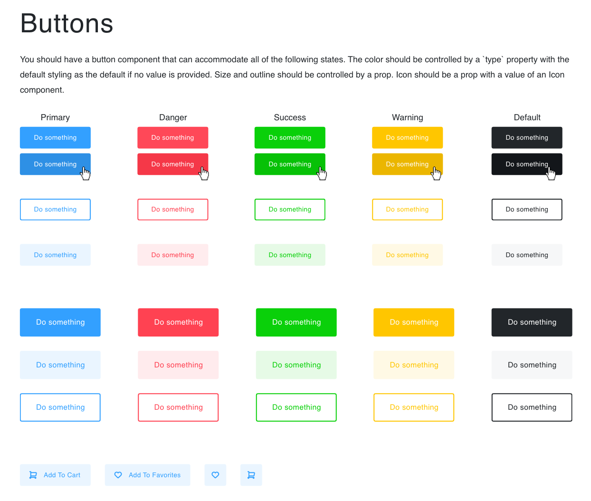
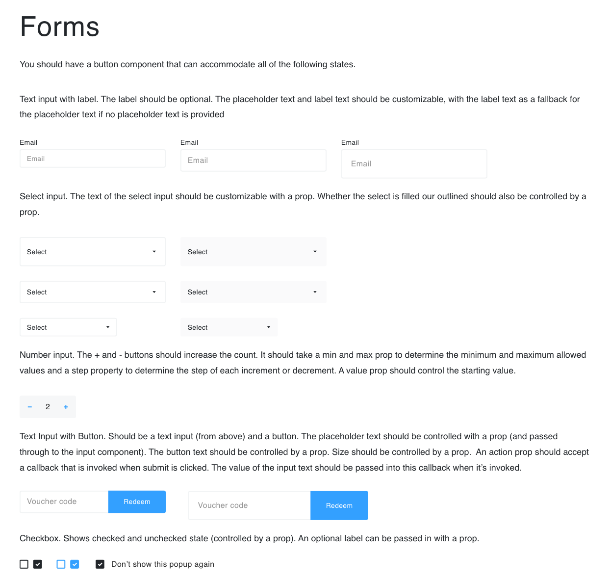

# React Component Library

This project was designed to test my understanding of React and apply it to building React Components. I was tasked with re-creating several components (buttons and forms) from a mockup reference. 

## Technical Requirements 

- Runs without errors
- Include the required components in the Adobe XD Mock-up
- Be deployed to GitHub Pages, Netlify, or Surge
- Be published to the NPM Package Registry

### Buttons

### Forms

## Built With 

- React and Components
- Storybook
- Adobe XD

## Deployment

Access my site here - 
[My Storybook](https://bb-storybookproject.netlify.com/?path=/story/form--checkbox-blue) 

## Authors 

* **Brian Brown**

## Acknowledgments

General Assembly